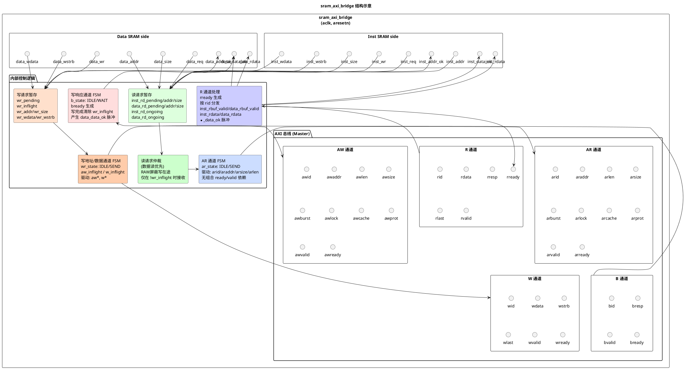

> [!question]
> ```
> ------------------------------------------------------------
> [  2587 ns] Error!!!
>   reference: PC = 0x1c01001c, wb_rf_wnum = 0x18, wb_rf_wdata = 0xbfaff050
>   mycpu    : PC = 0x1c01001c, wb_rf_wnum = 0x18, wb_rf_wdata = 0xbfaff000
> ```

![[image-3.png]]

pre-IF 保存指令的逻辑和 IF 级接受指令的逻辑冲突了，导致这个指令既被 IF 接受，也被 pre-IF 缓存，输出到下一条指令的 `input_inst` 并拉高 `input_inst_ready`

—— 什么时候需要缓存？
—— pre-IF级接收到指令内容，**并且这个指令的取址没有被移交给 IF 级**

_de完这个又出现了一堆bug，不写了，在 pre-IF 保存指令没有前途，焯！_

重新开始

---

> [!question]
> ```
> [1585417 ns] Error!!!
>     reference: PC = 0x1c07ef00, wb_rf_wnum = 0x06, wb_rf_wdata = 0x000d02d0
>     mycpu    : PC = 0x1c07ef04, wb_rf_wnum = 0x0d, wb_rf_wdata = 0xa616d000
> ```

观察 ID 得到的指令，从 `1c07ef00` 开始错位

```asm
1c07eef8:	289f5086 	ld.w	$r6,$r4,2004(0x7d4)
1c07eefc:	289f50a4 	ld.w	$r4,$r5,2004(0x7d4)
1c07ef00:	289f50a6 	ld.w	$r6,$r5,2004(0x7d4)
1c07ef04:	5c0b4d4b 	bne	$r10,$r11,2892(0xb4c) # 1c07fa50 <inst_error>
1c07ef08:	154c2dad 	lu12i.w	$r13,-368275(0xa616d)
1c07ef0c:	0286f9ad 	addi.w	$r13,$r13,446(0x1be)
```

![[image-4.png]]

![[image-5.png]]

上一个指令还没有传给 ID 级，下一个指令的数据就从 inst_sram 返回了

两个方案：

1. 在 IF 级加一个大小为 1 的 buffer
2. 在 pre-IF 记录指令，然后传给 IF

第二种思路就是刚刚已经试过了的，不太行

改成在IF级记录一下还没处理的请求，过了



