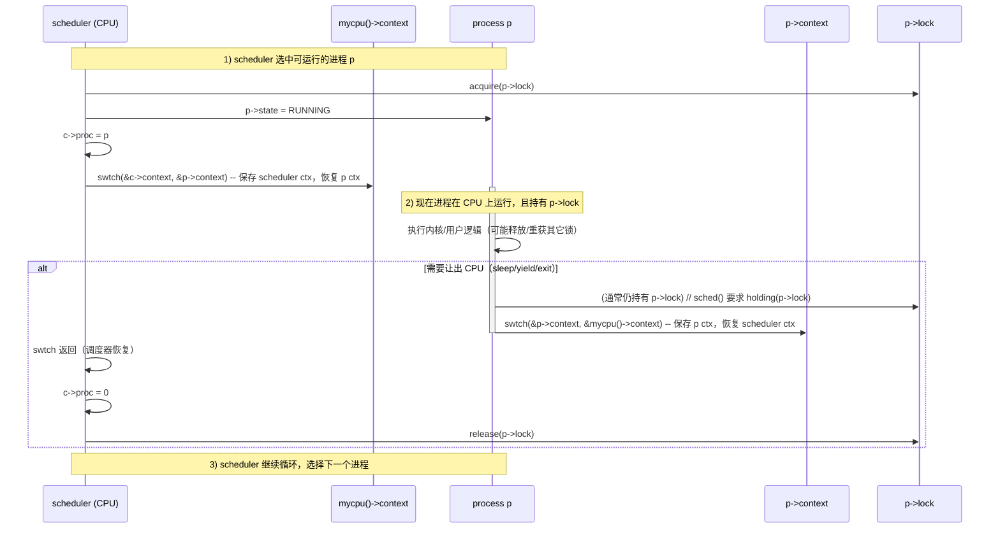

## 第零部分:初识 xv6

在xv6的项目结构中,操作系统内核的代码在 `kernel` 文件夹下,运行在操作系统之上用户态程序在 `user` 文件夹下。本节的目的是带大家初步认识xv6操作系统,涉及的源码文件都在 `user` 文件夹下。

### 基础题

> [!question]
> 
> - 安装相应工具链,在qemu 中运行xv6。并在操作系统中运行 `ls` 命令。
>     

> [!question]
> 
> - 阅读 `ls.c`。请回答:代码中的 `read()` 函数和 `printf()` 函数哪个是系统调用?它们的函数声明在哪里,函数定义在哪里?  
>     

`printf: user/printf.c, kernel/printf.c`  
`read: user/usys.S`

> [!question]
> 
> - 阅读 `usys.S`,查阅RISC-V相关知识,请问 `ecall` 指令的功能是什么?(如果找不到 `usys.S`,请自我反思一下,不要阅读静态代码)

触发 environment call
### 进阶题

> [!question]
> 
> - 阅读xv6 项目相关的 `Makefile` 文件、`mkfs.c` 文件和链接器相关文件,分析xv6 把内核和用户态程序编译链接的整个过程。并思考一个问题,xv6运行的时候,`ls` 可以看到里面有一个 `README` 文件,我在xv6操作系统把它删除,为什么本地项目的 `README` 文件仍存在 (反之如此)?
>     

- 编译流程：把内核源码和用户程序分别编译成对象文件（.o），再分别用不同的链接脚本（[kernel.ld](vscode-file://vscode-app/Applications/Visual%20Studio%20Code.app/Contents/Resources/app/out/vs/code/electron-browser/workbench/workbench.html) / [user.ld](vscode-file://vscode-app/Applications/Visual%20Studio%20Code.app/Contents/Resources/app/out/vs/code/electron-browser/workbench/workbench.html)）把内核和每个用户程序链接成各自的 ELF 可执行文件或 kernel 二进制。
- 文件系统映像 [fs.img](vscode-file://vscode-app/Applications/Visual%20Studio%20Code.app/Contents/Resources/app/out/vs/code/electron-browser/workbench/workbench.html)：通过 [mkfs](vscode-file://vscode-app/Applications/Visual%20Studio%20Code.app/Contents/Resources/app/out/vs/code/electron-browser/workbench/workbench.html) 程序把（构建好的）用户程序、README 等 host 上的文件拷贝到一个磁盘映像文件 [fs.img](vscode-file://vscode-app/Applications/Visual%20Studio%20Code.app/Contents/Resources/app/out/vs/code/electron-browser/workbench/workbench.html)（在 Makefile 中由 mkfs/mkfs 调用完成）。
- 运行时：QEMU 启动时把 [fs.img](vscode-file://vscode-app/Applications/Visual%20Studio%20Code.app/Contents/Resources/app/out/vs/code/electron-browser/workbench/workbench.html) 当作磁盘挂载给 guest（xv6），guest 在其文件系统上做的删除/修改仅影响 [fs.img](vscode-file://vscode-app/Applications/Visual%20Studio%20Code.app/Contents/Resources/app/out/vs/code/electron-browser/workbench/workbench.html)（guest 的磁盘内容）；宿主的仓库文件（如项目根目录下的 [README](vscode-file://vscode-app/Applications/Visual%20Studio%20Code.app/Contents/Resources/app/out/vs/code/electron-browser/workbench/workbench.html)）是普通的 host 文件，不会被 guest 的文件系统操作影响，反之亦然，除非你把 [fs.img](vscode-file://vscode-app/Applications/Visual%20Studio%20Code.app/Contents/Resources/app/out/vs/code/electron-browser/workbench/workbench.html) 重写为从宿主文件复制的版本（即重新运行 mkfs）。

链接：

- kernel 链接：
    - `kernel/kernel.ld`把入口放在固定物理地址 0x80000000（QEMU -kernel 跳转到此地址），把 trampoline 段放在单页位置（并且在链接脚本里做了对齐与断言），并把 .text/.rodata/.data/.bss 等段放好。内核最终二进制 `kernel/kernel` 是针对裸机的内核映像。
    - 链接后 Makefile 额外用 `objdump` 生成 `kernel/kernel.asm` 和 `kernel/kernel.sym` 供调试/分析。
- user 链接：Makefile 对单个用户程序用 `user/user.ld`，例如：  
    - user.ld 把用户程序的起始虚拟地址设为 0x0（在用户页表/仿真环境里这是用户虚拟地址空间的起点），排列 .text/.data/.bss。每个用户程序生成一个 ELF 可执行（例如 `_ls`、`_cat` 等）。

3. 生成文件系统映像 [fs.img](vscode-file://vscode-app/Applications/Visual%20Studio%20Code.app/Contents/Resources/app/out/vs/code/electron-browser/workbench/workbench.html)（mkfs）
- Makefile 中：  
    fs.img: mkfs/mkfs README $(UPROGS)  
    mkfs/mkfs fs.img README $(UPROGS)
    - 这条命令用 [mkfs](vscode-file://vscode-app/Applications/Visual%20Studio%20Code.app/Contents/Resources/app/out/vs/code/electron-browser/workbench/workbench.html)（编译生成的 host 程序）创建磁盘映像文件 [fs.img](vscode-file://vscode-app/Applications/Visual%20Studio%20Code.app/Contents/Resources/app/out/vs/code/electron-browser/workbench/workbench.html)，并将传给它的文件（[README](vscode-file://vscode-app/Applications/Visual%20Studio%20Code.app/Contents/Resources/app/out/vs/code/electron-browser/workbench/workbench.html)，以及 [user](vscode-file://vscode-app/Applications/Visual%20Studio%20Code.app/Contents/Resources/app/out/vs/code/electron-browser/workbench/workbench.html) 下编译好的用户二进制 `_cat`、`_ls` 等）写入到根目录下。
- [mkfs.c](vscode-file://vscode-app/Applications/Visual%20Studio%20Code.app/Contents/Resources/app/out/vs/code/electron-browser/workbench/workbench.html) 的行为：
    - 创建一个固定大小（FSSIZE）并清零的映像文件。
    - 写 superblock（sb）、inode 表、位图等元数据（函数 `balloc` 等）。
    - 为根目录（inode ROOTINO）分配一个 inode，并创建 `.` 和 `..` 条目。
    - 对传入的每个路径（比如 [README](vscode-file://vscode-app/Applications/Visual%20Studio%20Code.app/Contents/Resources/app/out/vs/code/electron-browser/workbench/workbench.html)、[cat](vscode-file://vscode-app/Applications/Visual%20Studio%20Code.app/Contents/Resources/app/out/vs/code/electron-browser/workbench/workbench.html) 等）：
        - 如果由 [user](vscode-file://vscode-app/Applications/Visual%20Studio%20Code.app/Contents/Resources/app/out/vs/code/electron-browser/workbench/workbench.html) 前缀，则 [mkfs](vscode-file://vscode-app/Applications/Visual%20Studio%20Code.app/Contents/Resources/app/out/vs/code/electron-browser/workbench/workbench.html) 会把 [user](vscode-file://vscode-app/Applications/Visual%20Studio%20Code.app/Contents/Resources/app/out/vs/code/electron-browser/workbench/workbench.html) 去掉；如果文件名以 `_` 开头，它会把前导 `_` 去掉（so `_cat` 写入 fs 时名为 `cat`），这是 Makefile 对避免 host 在构建目录上执行用户程序的一种保护措施。
        - 为每个文件分配 inode，把文件内容写入数据块（`iappend`），并把目录项加入到根目录 inode。
    - 最终把位图写回并关闭映像。

---

## 第一部分:系统启动与进程数据结构

虽然真实的计算机中只有少量的物理CPU可用,但是操作系统通过虚拟化CPU的功能,为用户提供了几乎无数个CPU可用的假象。操作系统为正在运行的程序所提供的抽象,就是进程。本节主要分析xv6 内核的启动流程,理解xv6中的进程抽象,所涉及的源码均在 `kernel` 文件夹下。

### 基础题

> [!question]
> 
> - 使用 `gdb` 给xv6的内核打断点,请回答xv6内核运行的第一条指令是什么,它的物理地址是什么?  

`0x80000000: la sp, stack0`

> [!question]
> 
> - `entry.S` 文件中的 `_entry` 做了什么,之后程序跳转到哪里执行?  

设置栈环境，然后跳转到 start

1. 硬件上电

2. QEMU 模拟固件加载引导扇区,引导程序加载内核到内存，跳转到内核入口地址（ kernel/entry.S ）
3. 内核入口阶段(kernel/entry.S)初始化内核栈指针，CPU状态由M态切换为S态，跳转到kernel main函数
4. 内核初始化（main.c）初始化第一个用户进程userinit()，它会启动终端/sh.最后开启调度器scheduler(),运行各用户程序

> [!question]
> 
> - 阅读 `riscv.h` 并查阅相关资料,回答C代码在调用汇编代码时,汇编代码是如何获取到相应参数的? `riscv.h` 中涉及的C代码调用的汇编指令的含义是什么?

通过寄存器传参数，其中大数据传指针，超过数量的用栈传

> [!question]
> 
> - 在 `start.c` 的 `start()` 函数中,`mret` 指令的作用是什么?在调用 `mret` 指令的之前和之后,CPU分别运行在RISC-V 架构的什么工作模式下? `start()` 函数调用完后,程序走到了哪里?
>     

退出 $M$ 模式

根据代码，

```cpp
// entry.S jumps here in machine mode on stack0.
void
start()
{
  // set M Previous Privilege mode to Supervisor, for mret.
  unsigned long x = r_mstatus();
  x &= ~MSTATUS_MPP_MASK;
  x |= MSTATUS_MPP_S;
  w_mstatus(x);

  // set M Exception Program Counter to main, for mret.
  // requires gcc -mcmodel=medany
  w_mepc((uint64)main);

  // disable paging for now.
  w_satp(0);

  // delegate all interrupts and exceptions to supervisor mode.
  w_medeleg(0xffff);
  w_mideleg(0xffff);
  w_sie(r_sie() | SIE_SEIE | SIE_STIE);

  // configure Physical Memory Protection to give supervisor mode
  // access to all of physical memory.
  w_pmpaddr0(0x3fffffffffffffull);
  w_pmpcfg0(0xf);

  // ask for clock interrupts.
  timerinit();

  // keep each CPU's hartid in its tp register, for cpuid().
  int id = r_mhartid();
  w_tp(id);

  // switch to supervisor mode and jump to main().
  asm volatile("mret");
}
```

之前：$M$ 态，之后：$S$ 态（由代码中 MPP 决定）

走完之后到了 main

> [!question]
> 
> - 阅读 `proc.c` 和 `proc.h`,理解进程相关的数据结构,理解其中重要字段的含义和作用,如:`pid`, `state`, `trapframe`, `context`。
>     

```cpp
enum procstate { UNUSED, USED, SLEEPING, RUNNABLE, RUNNING, ZOMBIE };
```

```cpp
// Per-process state
struct proc {
  struct spinlock lock;

  // p->lock must be held when using these:
  enum procstate state;        // Process state
  void *chan;                  // If non-zero, sleeping on chan
  int killed;                  // If non-zero, have been killed
  int xstate;                  // Exit status to be returned to parent's wait
  int pid;                     // Process ID

  // wait_lock must be held when using this:
  struct proc *parent;         // Parent process

  // these are private to the process, so p->lock need not be held.
  uint64 kstack;               // Virtual address of kernel stack
  uint64 sz;                   // Size of process memory (bytes)
  pagetable_t pagetable;       // User page table
  struct trapframe *trapframe; // data page for trampoline.S
  struct context context;      // swtch() here to run process
  struct file *ofile[NOFILE];  // Open files
  struct inode *cwd;           // Current directory
  char name[16];               // Process name (debugging)
};
```

trapframe: 用户 trap 的上下文
context: kernel `swtch()` 切换的上下文

> [!question]
> 
> - 在 `proc.c` 的 `procinit()` 函数做了什么? `procinit()` 之后,每个进程结构体的内核栈布局是什么样?
>     

```cpp
// initialize the proc table.
void
procinit(void)
{
  struct proc *p;
  
  initlock(&pid_lock, "nextpid");
  initlock(&wait_lock, "wait_lock");
  for(p = proc; p < &proc[NPROC]; p++) {
      initlock(&p->lock, "proc");
      p->state = UNUSED;
      p->kstack = KSTACK((int) (p - proc));
  }
}
```

后面 for 循环遍历全局进程表 proc[] 并进行初始化，将state设为UNUSED并为每个进程分配独立内核栈。

栈布局：
查看 KSTACK

```
// one beyond the highest possible virtual address.
// MAXVA is actually one bit less than the max allowed by
// Sv39, to avoid having to sign-extend virtual addresses
// that have the high bit set.
#define MAXVA (1L << (9 + 9 + 9 + 12 - 1))

// map the trampoline page to the highest address,
// in both user and kernel space.
#define TRAMPOLINE (MAXVA - PGSIZE)

#define KSTACK(p) (TRAMPOLINE - ((p)+1)* 2*PGSIZE)
```

TRAMPOLINE 在最高地址，然后每个 proc 分配两个page 的 kstack
在注释中“each surrounded by invalid guard pages”可见，在每个进程结构体的内核栈中，一页为保护页，一页作为实际栈。

> [!question]
> 
> - 第一个用户进程是在哪里初始化的?
>     

```cpp
void
userinit(void)
{
  struct proc *p;

  p = allocproc();
  initproc = p;
  
  p->cwd = namei("/");

  p->state = RUNNABLE;

  release(&p->lock);
}
```
### 进阶题

> [!question]
> 
> - Linux 中进程相关的数据结构在哪里?相比xv6的PCB增加了哪些结构?请选取其中1~2项结合代码详细分析。
>     


---

## 第二部分:进程调度

在xv6 操作系统进行完一系列初始化后,它将进入到进程调度的逻辑中,实现时分共享CPU的能力。

### 基础题

> [!question]
> 
> - 进程调度逻辑的主体 `scheduler()` 函数的主要逻辑是什么?访问进程时为什么需要加锁?
>     

```c
// Per-CPU process scheduler.
// Each CPU calls scheduler() after setting itself up.
// Scheduler never returns.  It loops, doing:
//  - choose a process to run.
//  - swtch to start running that process.
//  - eventually that process transfers control
//    via swtch back to the scheduler.
void
scheduler(void)
{
  struct proc *p;
  struct cpu *c = mycpu();
  c->proc = 0;
  for(;;){
    // The most recent process to run may have had interrupts
    // turned off; enable them to avoid a deadlock if all
    // processes are waiting. Then turn them back off
    // to avoid a possible race between an interrupt
    // and wfi.
    intr_on();
    intr_off();
    int found = 0;
    for(p = proc; p < &proc[NPROC]; p++) {
      acquire(&p->lock);
      if(p->state == RUNNABLE) {
        // Switch to chosen process.  It is the process's job
        // to release its lock and then reacquire it
        // before jumping back to us.
        p->state = RUNNING;
        c->proc = p;
        swtch(&c->context, &p->context);
        // Process is done running for now.
        // It should have changed its p->state before coming back.
        c->proc = 0;
        found = 1;
      }
      release(&p->lock);
    }
    if(found == 0) {
      // nothing to run; stop running on this core until an interrupt.
      asm volatile("wfi");
    }
  }
}
```

注意这里的 `intr_on,intr_off` 是为了处理 pending 的中断，`found == 0` 时，`wfi` 会在中断到达前停住，但到达时中断使能 `SIE=0` ，所以不会立即跳转，会pending，等到 `intr_on` 的时候再跳转

`swtch` 保存上下文到 `context`，`context` 存在了全局的 cpu 信息数组中和进程信息中。

用户进程运行时，切换前的 cpu 上下文保存到它的 `context` 域中，kernel运行时，进程信息保存在它的 `context` 域中。



> [!question]
> 
> - `scheduler()` 函数中的 `swtch()` 函数做了什么?它将控制转移到了什么地方?这是如何实现的?
>     

切换上下文，将控制从参数 1 转为参数 2，通过设置 sp/ra 实现

> [!question]
> 
> - `swtch()` 函数保存了哪些寄存器,为什么只需要保存这些寄存器?
>     

保存了 `ra, sp, s0-s11`，因为根据 abi，其他的寄存器会在函数调用过程中由调用者保存在他们的栈上。

对于调用 `swtch` 的函数而言，除了上述需要保存的寄存器之外，其他的寄存器经过调用之后被改了是可以接受的。

> [!question]
> 
> - `proc.c` 中的 `sched()` 和 `yield()` 函数做了什么?
>     

sched: 

保存当前 CPU 中断状态
检查当前进程状态，然后将当前进程设为 `RUNABLE`，然后切换至 scheduler
其他进程执行完后，恢复 CPU 中断状态

yield:

获取 p->lock，准备调度，调度会恢复当前CPU曾经在 scheduler 的执行点，而这个点正是 切换至 $p$ 之前的状态，需要持有 p->lock

### 进阶题

> [!question]
> 
> - xv6 和 Linux中调度器如何选择下一个要执行的进程?可选取一个Linux 调度算法针对代码详细分析。
>     

> [!question]
> 
> - 对比 Linux 6.6引入的EEVDF调度器,与传统CFS调度器在设计思路等方面的不同。
>     

---

## 第三部分:trap

由于不同教材的翻译问题,trap、exception、interrupt、device interrupt、system call 等概念总是让学生混乱。请阅读xv6配套教材,理解在xv6的语境下,上述概念的含义。这有助于代码的理解。

### 基础题

> [!question]
> 
> - 在用户态发生trap时,CPU会跳转到哪里执行?为什么跳到这里(从RISC-V 体系结构的角度解释)?
>     

1. Trap（陷入 / trap）

- 含义：广义上指从当前程序流跳转到“陷阱/异常处理”机制的事件，包括同步的 exception、异步的 interrupt，或软件触发的 system call。即“发生了需要内核处理的事情，控制流被转到 trap 处理路径”。
- xv6 对应：usertrap() / kerneltrap() 是处理 trap 的 C 端入口；具体的汇编入口在 `trampoline.S`（user→kernel 的 uservec/userret）和 `kernelvec.S`（kerneltrap 的汇编入口）。
- 代码位置：`kernel/trap.c: usertrap(), kerneltrap(), prepare_return()`；`kernel/trampoline.S`、`kernel/kernelvec.S`。

2. Exception（异常）

- 含义：由当前 CPU 指令同步触发的事件，和指令执行密切相关（例如：系统调用的 ecall、访问非法指令、页错误、算术错误等）。异常是“同步”的（发生时，PC 确切地指向触发异常的指令）。
- xv6 中的例子：user 发出 ecall 导致 `scause==8`（environment call from U-mode）；加载/存储访问产生的页错误（r_scause() == 13/15 等）。
- 代码：[trap.c](vscode-file://vscode-app/Applications/Visual%20Studio%20Code.app/Contents/Resources/app/out/vs/code/electron-browser/workbench/workbench.html) 在 `usertrap()` 里通过 [r_scause()](vscode-file://vscode-app/Applications/Visual%20Studio%20Code.app/Contents/Resources/app/out/vs/code/electron-browser/workbench/workbench.html) 判断 `== 8` 来处理 system call；对页错调用 `vmfault()`（见 [trap.c](vscode-file://vscode-app/Applications/Visual%20Studio%20Code.app/Contents/Resources/app/out/vs/code/electron-browser/workbench/workbench.html) 中对应分支）。
- RISC‑V 细节：`sepc`（保存异常发生时的 PC），`scause`（原因码），`stval`（可选错误地址）。

3. Interrupt（中断）

- 含义：通常是外设或定时器等异步产生的信号，非由当前执行指令直接导致（即“异步”）。硬件将中断路由到处理程序，处理时仍会有 `scause` 指示其为中断类型（RISC‑V 把“中断”作为 scause 的高位标志）。
- xv6 区分主要类型：外部设备中断（经 PLIC）、时钟（timer）中断等。`devintr()` 用来解码并分发设备中断。
- 代码：`kernel/trap.c::devintr()`，会识别外部中断（scause == 0x8000000000000009L）和时钟中断（0x8000000000000005L），并调用 `uartintr()`、`virtio_disk_intr()`、`clockintr()` 等。`devintr()` 返回：2 表示 timer、1 表示其他设备、0 表示非识别。
- 典型后果：时钟中断常用来触发抢占（xv6 在 `usertrap()` 里若 `which_dev==2` 则 `yield()`），外设中断用于驱动 I/O。

4. Device interrupt（设备中断）

- 含义：外部硬件设备（如串口 UART、virtio 磁盘）通过平台中断控制器（PLIC）发出的中断。
- xv6 实现：`devintr()` 从 `scause` 判断是 PLIC 的外部中断后调用 `plic_claim()` 得到 irq，再根据 irq 调用 `uartintr()` 或 `virtio_disk_intr()`。处理完成后调用 `plic_complete(irq)` 告知 PLIC 可再次接收该设备中断。
- 代码位置：`kernel/trap.c::devintr()`、`kernel/uart.c::uartintr()`、[virtio_disk.c](vscode-file://vscode-app/Applications/Visual%20Studio%20Code.app/Contents/Resources/app/out/vs/code/electron-browser/workbench/workbench.html)（或 `virtio_disk.c` 中的中断处理）。

5. System call（系统调用）

- 含义：用户程序主动发出的请求内核服务，是一种由用户空间执行的同步异常（RISC‑V 用 ecall 指令），它把控制权转到内核，并按约定通过寄存器传递系统调用号和参数。
- xv6 流程：当用户执行 ecall 时，硬件产生 trap（`scause==8`），控制进入 `usertrap()`，`usertrap()` 会把 `sepc`（即指向 ecall 的 pc）加 4（以返回到下一条指令），打开中断（intr_on），然后调用 [syscall()](vscode-file://vscode-app/Applications/Visual%20Studio%20Code.app/Contents/Resources/app/out/vs/code/electron-browser/workbench/workbench.html)（在 [syscall.c](vscode-file://vscode-app/Applications/Visual%20Studio%20Code.app/Contents/Resources/app/out/vs/code/electron-browser/workbench/workbench.html) 中）完成具体系统调用处理。
- 代码位置：[trap.c](vscode-file://vscode-app/Applications/Visual%20Studio%20Code.app/Contents/Resources/app/out/vs/code/electron-browser/workbench/workbench.html) 中判断 [r_scause() == 8](vscode-file://vscode-app/Applications/Visual%20Studio%20Code.app/Contents/Resources/app/out/vs/code/electron-browser/workbench/workbench.html) 后处理；[syscall.c](vscode-file://vscode-app/Applications/Visual%20Studio%20Code.app/Contents/Resources/app/out/vs/code/electron-browser/workbench/workbench.html) 包含 syscall 分发代码。

> [!question]
> 
> - 在用户态发生 trap时,CPU会跳转到哪里执行?为什么跳到这里(从RISC-V 体系结构的角度解释)?
>     

跳转到 trampoline 页中的 uservec

> [!question]
> 
> - `trapframe` 是trap 处理时的重要数据结构,它的作用是什么?
>     

> [!question]
> 
> - 在用户态发生 trap 和内核态发生trap时,保存和恢复现场的方式有什么区别?
>     

> [!question]
> 
> - 如何区分 trap 的类型?
>     

> [!question]
> 
> - 作为进程数据结构中的重要字段, `trapframe` 和 `context` 中都定义了很多寄存器,但是两者有些区别,请从它们的功能角度分析原因。
>     

> [!question]
> 
> - 内核态发生的 trap,在处理完trap后如何返回的?返回后操作系统处于内核态还是用户态?
>     

> [!question]
> 
> - 用户态发生的 trap,在处理完trap 后如何返回的?返回后操作系统处于内核态还是用户态?
>     

> [!question]
> 
> - xv6 中实现了哪些系统调用,这些系统调用的定义在哪里?
>     

> [!question]
> 
> - 在发起系统调用时,xv6使用了哪条指令实现用户态到内核态的切换?xv6中是如何在用户态和内核态传递系统调用的参数的?
>     

### 进阶题

> [!question]
> 
> - 如果xv6 在内核态处理 trap的过程中,需要切换到用户态来执行一个处理函数,那么它需要保存现场(我们假设这个处理函数是安全的,并且它会调用另一个系统调用来恢复现场)。请问它需要保存那些寄存器?
>     

> [!question]
> 
> - Linux 中内核态和用户态之间数据传递的有哪些方式?请结合具体代码分析。
>     

---

## 第四部分:进程的运行

### 基础题

> [!question]
> 
> - `proc.c` `uchar initcode[]` 的诡异的二进制数据的含义是什么?为什么 `userinit()` 函数要把它拷贝到 `usr page` 中?它和 `user/initCode.S` 有什么联系?
>     

> [!question]
> 
> - 第一个进程启动后在用户态执行的程序是什么?这个程序执行了哪个系统调用?
>     

> [!question]
> 
> - 在 `exec.c` 的 `exec()` 中,用到的 `struct elfhdr` 数据结构,其中 `magic`, `phnum`, `phoff` 等字段的作用是什么?以及 `struct proghdr` 的数据结构,其中 `vaddr`, `memsz`, `filesz` 等字段的作用是什么?
>     

> [!question]
> 
> - 在 `exec()` 中,如何确定并设置待运行的程序的PC值和栈指针?
>     

> [!question]
> 
> - `exec()` 执行完以后,返回的地址是什么?为什么?
>     

> [!question]
> 
> - 在 `user/init.c` 中调用了 `fork()` 函数创建子进程。请问在调用 `fork()` 系统调用后,是父进程先返回还是子进程先返回?
>     

> [!question]
> 
> - 在调用 `fork()` 系统调用后,子进程是如何从 `RUNNABLE` 转换到 `RUNNING` 状态的?
>     


> [!question]
> 
> - 对于父进程和子进程,`fork()` 返回的 `pid` 相同么?为什么?
>     

> [!question]
> 
> - `wait` 系统调用的功能?
>     

### 进阶题

> [!question]
> 
> - 请结合代码详细分析 Linux中elf 文件格式(利用 `readelf` 命令),以及链接和加载的机制。
>
